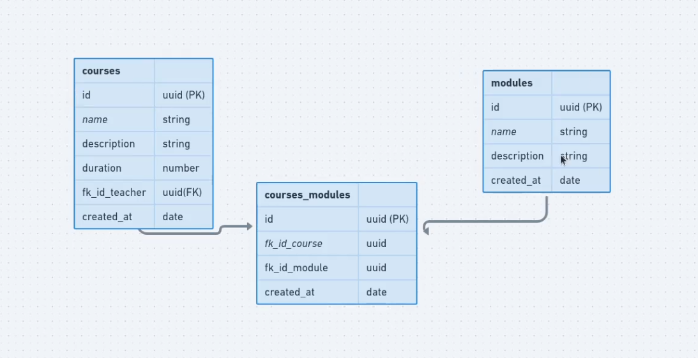

# prisma-nodejs

## Subindo o banco de dados para
Para subir o banco de dados psql basta rodar o comando a baixo.
obs: Deverá ter o docker instalado na maquina

```md
yarn start-db
```
 ## [Prisma CLI reference](https://www.prisma.io/docs/reference/api-reference/command-reference)


apos subir o servidor psql devemos criar as migrations rodando o comando:
```md
yarn prisma generate
```
e depoisa
```md
yarn prisma db push
```

## Diagrama
